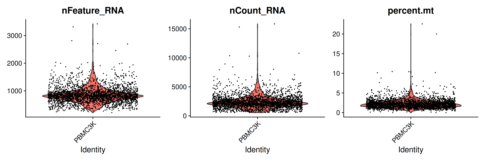
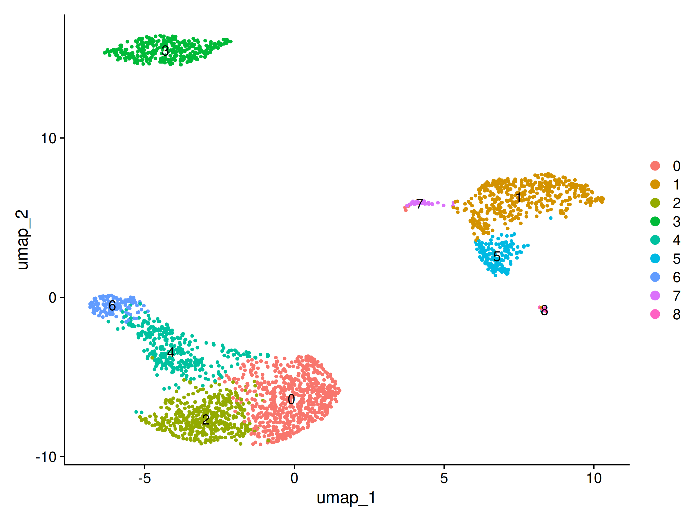
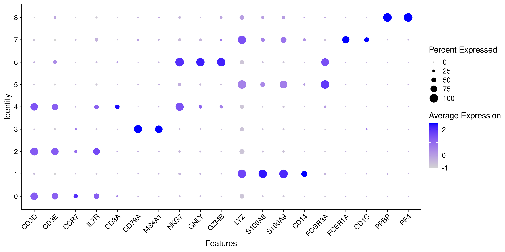
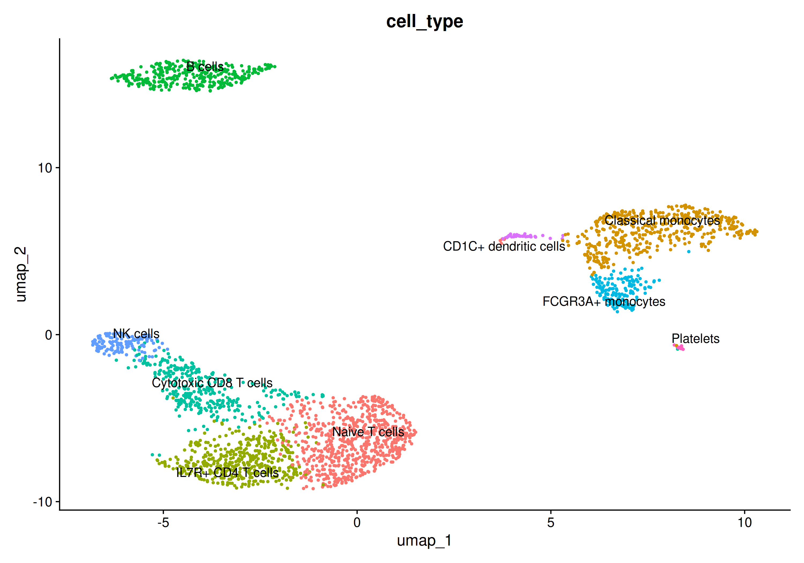

# Single-Cell RNA-seq PBMC Analysis

An end-to-end single-cell RNA-seq analysis of human peripheral blood mononuclear cells (PBMCs) using the 10x Genomics PBMC 3K dataset and Seurat.

The project starts from a Cell Ranger gene-barcode count matrix and performs quality control, normalization, feature selection, dimensionality reduction, clustering, marker-gene identification, and manual cell-type annotation.

## Dataset

- Dataset: 10x Genomics PBMC 3K
- Starting cells: 2,700
- Features: 32,738 genes
- Input: Cell Ranger filtered gene-barcode matrix
- Final cells after QC: 2,638

Dataset details are documented in [`docs/dataset.md`](docs/dataset.md).

## Analysis Workflow

The analysis was performed as a series of reproducible R/Seurat scripts:

1. Create Seurat object
2. Perform quality control and cell filtering
3. Normalize gene expression
4. Identify highly variable genes
5. Scale expression data
6. Perform principal component analysis (PCA)
7. Construct the cell-neighbor graph
8. Perform graph-based clustering
9. Generate a UMAP representation
10. Identify cluster-specific marker genes
11. Annotate clusters using canonical PBMC markers
12. Generate final annotation visualizations

Scripts are available in [`scripts/r/`](scripts/r/).

## Quality Control

Cells were evaluated using:

- number of detected genes (`nFeature_RNA`)
- total RNA counts (`nCount_RNA`)
- percentage of mitochondrial transcripts (`percent.mt`)

After filtering, 2,638 of the original 2,700 cells were retained.



## Dimensionality Reduction and Clustering

Highly variable genes were scaled and used for principal component analysis. The PCA elbow plot was inspected to select the dimensions used for downstream neighbor detection and clustering.


A shared nearest-neighbor graph was constructed using the selected principal components, followed by graph-based clustering. Nine clusters were identified.

UMAP was used to visualize the resulting cell populations.



## Cell-Type Annotation

Cluster identities were assigned manually using a combination of canonical PBMC markers and cluster-specific genes identified using Seurat's `FindAllMarkers()`.

Marker interpretation considered biological function, average log2 fold change, and the proportion of cells expressing each gene inside and outside the cluster rather than relying on statistical significance alone.

| Cluster | Cell type | Supporting markers |
|---|---|---|
| 0 | Naive T cells | CCR7, LEF1, TCF7, CD3D, CD3E |
| 1 | Classical monocytes | CD14, S100A8, S100A9, FCN1 |
| 2 | IL7R+ CD4 T cells | IL7R, CD40LG, CD3D, CD3E, GIMAP7 |
| 3 | B cells | CD79A, MS4A1 |
| 4 | Cytotoxic CD8 T cells | CD8A, CD3D, CCL5, GZMK, PRF1 |
| 5 | FCGR3A+ monocytes | FCGR3A, MS4A7, LST1 |
| 6 | NK cells | GNLY, KLRD1, FGFBP2, NKG7, GZMB |
| 7 | CD1C+ dendritic cells | CD1C, FCER1A, CLEC10A |
| 8 | Platelets | PF4, GP9, ITGA2B, GP1BA |

A more detailed explanation of the annotation strategy is available in [`docs/cell_type_annotation.md`](docs/cell_type_annotation.md).

### Marker Expression

Canonical marker expression across clusters was visualized using a Seurat DotPlot.



### Annotated PBMC Populations

The final annotated UMAP shows the major PBMC populations identified in the dataset.



## Key Results

The analysis resolved nine transcriptionally distinct populations representing major PBMC cell types, including T-cell populations, B cells, NK cells, classical and FCGR3A+ monocytes, CD1C+ dendritic cells, and a small platelet population.

Related cell types occupied neighboring regions of the UMAP. For example, cytotoxic CD8 T cells were positioned near NK cells, while classical and FCGR3A+ monocytes occupied neighboring myeloid regions.

## Tools

- R
- Seurat
- ggplot2
- Linux / WSL
- Git / GitHub

## Repository Structure

```text
.
├── data/
├── docs/
├── results/
│   ├── annotation/
│   ├── markers/
│   ├── pca/
│   ├── qc/
│   └── umap/
└── scripts/
    └── r/
